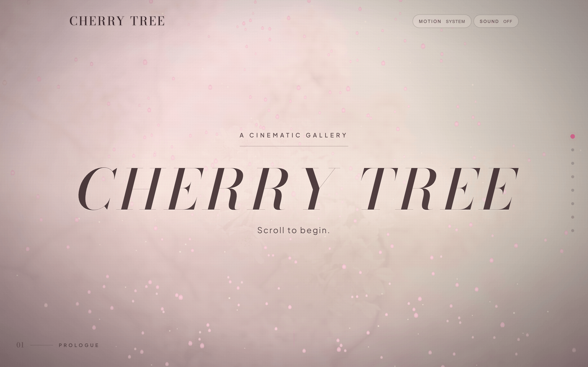
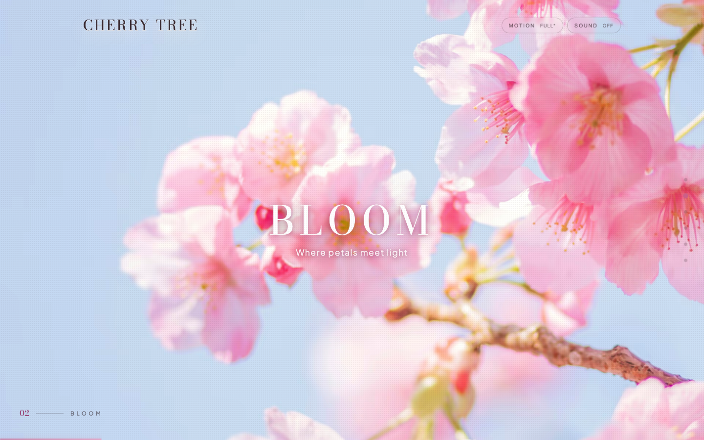
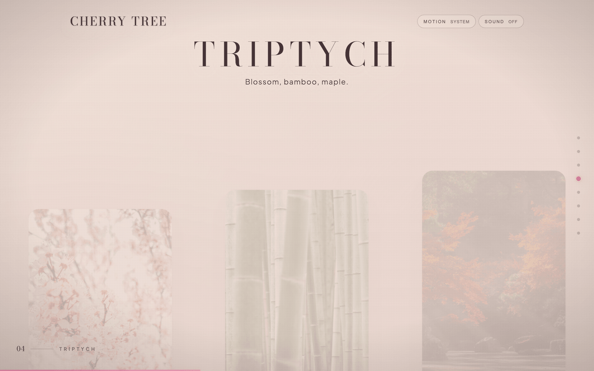
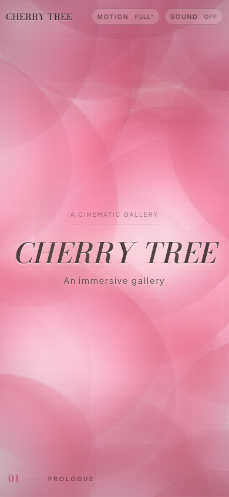

# Cherry Tree

> A scroll-driven cinematic gallery — six scenes, one continuous film.

**[cherry-tree-psi.vercel.app](https://cherry-tree-psi.vercel.app)**


---



---

Cherry Tree is a zero-framework, hand-authored web experience. Real-time WebGL petals fall through a Three.js hero scene. Scroll scrubs every animation through GSAP `ScrollTrigger`. Lenis shares a frame clock with GSAP so smoothing and animation never drift. Each of six scenes carries its own color temperature — the whole thing transitions like a cut between shots.

Built on vanilla ES modules. No React, no framework overhead — just full control over the browser, the render loop, and the timeline. Tuned across iPhone portrait, landscape, tablet, desktop, and ultrawide.

## The six scenes

| № | Scene | Treatment |
|---|---|---|
| 01 | **Prologue** | Real-time WebGL petal field, depth-of-field shader, cursor repulsion |
| 02 | **Bloom** | Photographic hero, long crossfade, saturation lift on scrub |
| 03 | **Triptych** | Three composite panels, parallax-deep motion preset |
| 04 | **Color Field** | Triple bloom layers, slow drift, painterly transition |
| 05 | **Stillness** | Single still image, film-dust grain overlay |
| 06 | **Epilogue** | Ambient glow, drift-slow preset, closing title |

<table>
  <tr>
    <td></td>
    <td></td>
  </tr>
  <tr>
    <td align="center"><sub>02 — Bloom</sub></td>
    <td align="center"><sub>03 — Triptych</sub></td>
  </tr>
</table>

## Stack

| Layer | Technology |
|---|---|
| 3D / WebGL | Three.js r181, custom `ShaderMaterial` |
| Animation | GSAP 3.13 + ScrollTrigger |
| Smooth scroll | Lenis 1.3 (shared frame clock with GSAP) |
| Build | Vite 8, manual vendor chunking |
| Images | Sharp — AVIF / WebP / JPEG + LQIP |
| Language | Vanilla ES2021, no framework |

## What's under the hood

- **Custom WebGL petal shader** — per-petal UV rotation, depth-of-field color shift, additive light-speck layer; 400 particles on desktop, 200 on mobile. Cursor repulsion is a vertex-shader visual displacement (the physics buffer stays untouched).
- **FLIP preloader** — brand text measures its own position, then animates directly into the hero title via `expo.inOut`. No clone hack. Hard 6-second safety timeout guarantees the loader can never hang.
- **Scene tinting** — an `IntersectionObserver` tracks which scene occupies the most viewport and dispatches `--scene-tint`, `--scene-ink`, and `--scene-grain` CSS variables in real time. The body inherits, so chrome and grain re-paint instantly on cut.
- **Velocity parallax** — scene text layers scrub `yPercent` against scroll direction via `ScrollTrigger.scrub`. Suppressed below 760px to keep mobile scrolling smooth.
- **Magnetic cursor** — ring snaps to interactive elements, morphs size, shows a contextual label.
- **Audio controller** — toggleable ambient bed with crossfade, persistent across reloads via `localStorage`.
- **Ghost nav + scene labels** — six dot indicators along the right rail track the active scene; current scene name appears at lower-left.
- **Reduced motion** — full fallback: static image, no scrub, no WebGL. User-overridable runtime toggle (no reload).
- **Responsive typography** — hero and epilogue titles use `clamp()` ceilings to stay on a single line from 375px through 1920px.
- **Lazy media hydration** — only the prologue and bloom scenes preload. Everything else hydrates 280px ahead of the viewport via `IntersectionObserver`.

## Performance

Current build output (Vite 8, gzipped): Three.js ~128 KB · GSAP ~44 KB · Lenis ~5 KB · main app ~5.5 KB (~14 KB raw).
Three.js defers behind `IntersectionObserver` + `requestIdleCallback` — it never touches first paint.

## Mobile



Polished pass across all iPhone sizes. The hero title is constrained by viewport height in landscape, by clamp ceilings in portrait. Velocity parallax, magnetic cursor, and the desktop scene-rail are suppressed below 760px.

## Local setup

```bash
git clone https://github.com/coleyrockin/CherryTree.git
cd CherryTree
npm install
npm run dev
```

| Script | |
|---|---|
| `npm run dev` | Vite dev server at 127.0.0.1:5173 |
| `npm run build` | Production build to `dist/` |
| `npm run preview` | Serve the production build locally |
| `npm run optimize-assets` | Regenerate responsive image sets from source files |

Dev and preview bind to localhost by default. For LAN or tunnel testing, opt in explicitly:

```bash
CHERRYTREE_EXPOSE_DEV_SERVER=true npm run dev
```

## Project structure

```
src/
├── content/
│   └── sceneManifest.js      # Scene definitions, tints, motion presets
├── experience/
│   ├── heroWebgl.js          # Three.js petal field + custom shader
│   ├── preloader.js          # FLIP brand → hero title transition
│   ├── sceneController.js    # IntersectionObserver, tint dispatch, lazy media
│   ├── sceneNav.js           # Right-rail numerals + active state
│   ├── scrollEffects.js      # GSAP ScrollTrigger orchestration
│   ├── scrollVelocityFx.js   # Velocity-driven parallax
│   ├── magneticCursor.js     # Custom cursor with contextual labels
│   ├── microInteractions.js  # Hover, focus, scroll-hint micro-anims
│   ├── textAnimations.js     # Char/word splits and reveals
│   └── audioController.js    # Ambient bed, crossfade, persistence
├── styles/                   # base, scenes, preloader, cursor, nav
├── utils/                    # splitText, scrollVelocity, storage
└── main.js                   # Composition root
```

## License

MIT — see [LICENSE](./LICENSE).

---

Built by [Boyd Roberts](https://github.com/coleyrockin).
