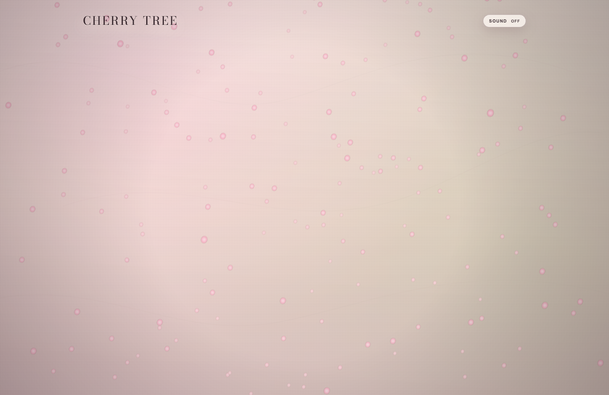

# Cherry Tree

Cherry Tree is a cinematic, scroll-driven web experience built with Vite, Three.js, GSAP, and Lenis.



## Highlights

- WebGL prologue scene with animated petals and pointer-reactive depth.
- Multi-scene gallery flow with scroll choreography and atmospheric color transitions.
- Progressive media loading for large visual assets.
- Ambient audio toggle with graceful fallback behavior.
- Reduced-motion aware behavior for accessibility-conscious browsing.

## Run Locally

```bash
npm install
npm run dev
```

## Production Build

```bash
npm run build
npm run preview
```
