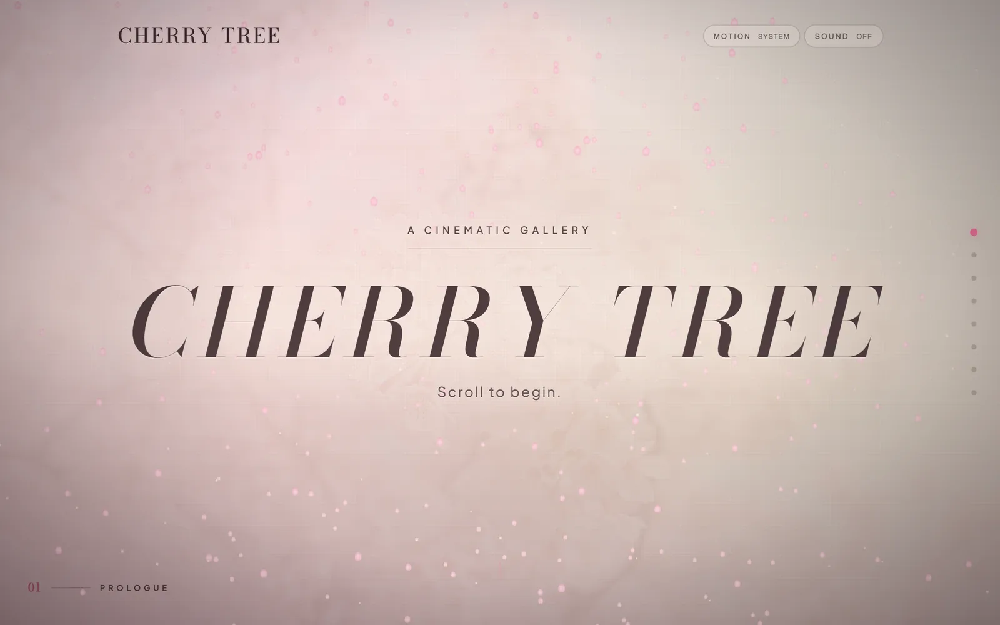
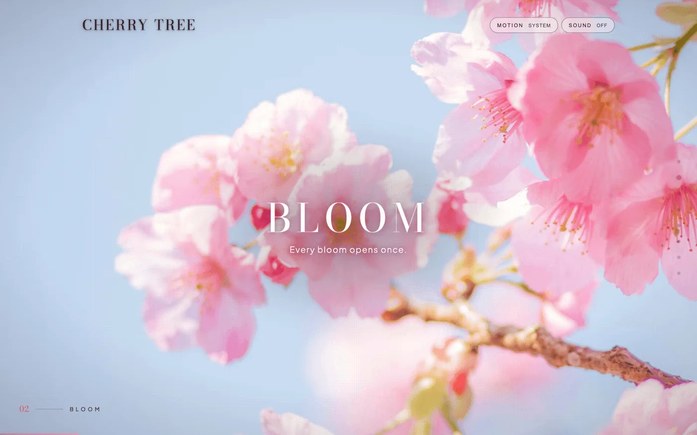
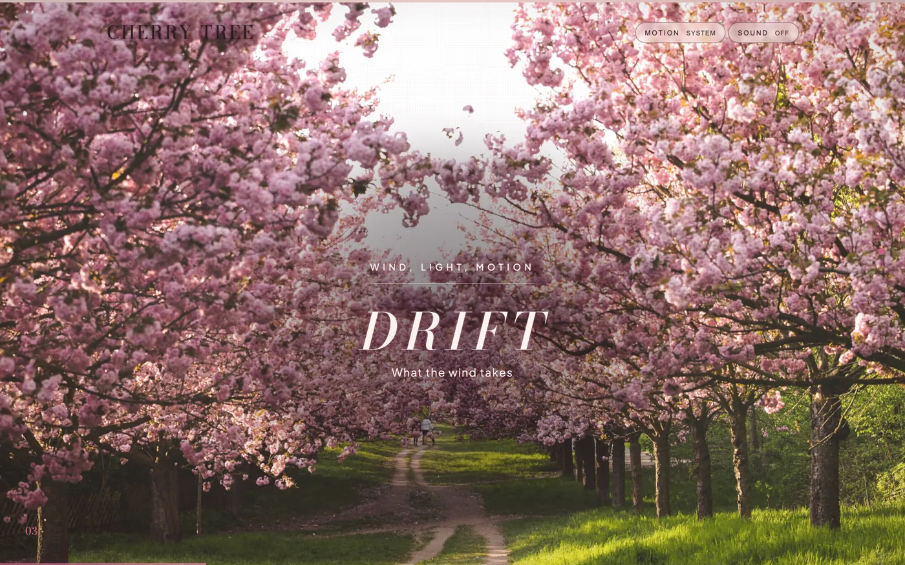
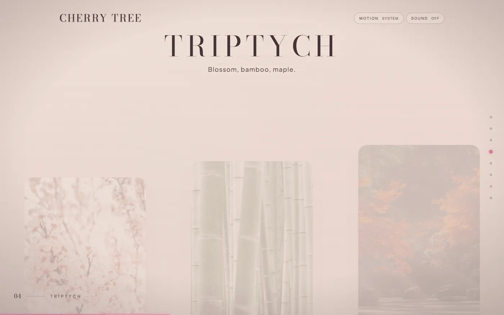
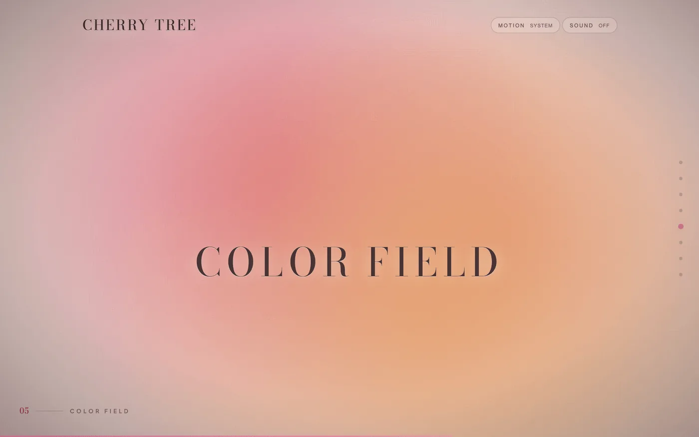
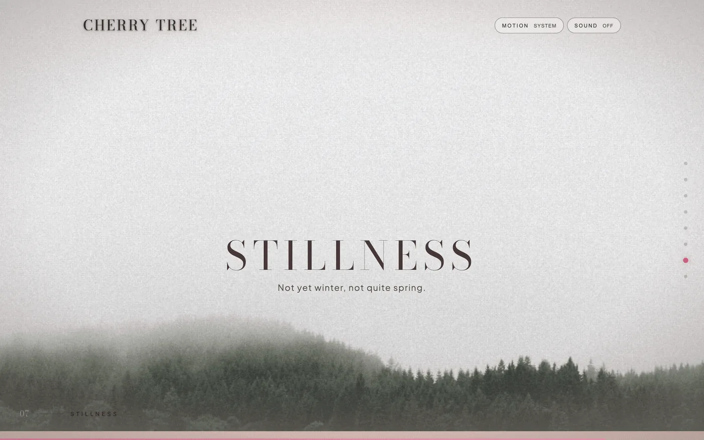
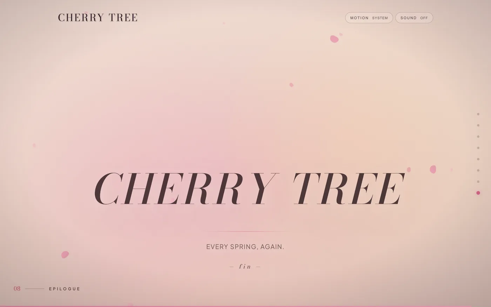

# Cherry Tree

A scroll-driven gallery of eight scenes, stitched together and scored like a continuous film.

**[cherry-tree-psi.vercel.app](https://cherry-tree-psi.vercel.app)**


---



---

This is a portfolio piece and a stress test: how far can vanilla JavaScript go before a framework earns its place? No React, no abstraction layer — just ES modules, a custom Three.js shader, GSAP timelines scrubbed against scroll position, and a lot of tuning.

If you're studying scroll-driven animation patterns or building something similar, the implementation is worth reading. Most of the interesting decisions live in `src/experience/`.

## The Eight Scenes

| № | Scene | Treatment |
|---|---|---|
| 01 | **Prologue** | Real-time WebGL petal field — depth-of-field shader, cursor repulsion, 400 particles |
| 02 | **Bloom** | Photographic hero, long crossfade, saturation lift on scrub |
| 03 | **Drift** | Wind-path photography, deep parallax |
| 04 | **Triptych** | Three composite panels, split parallax |
| 05 | **Color Field** | Three chromatic fields drifting simultaneously (Rothko-in-motion) |
| 06 | **Koi** | Full-bleed 4K koi-pond video, lazy-loaded, dark chrome |
| 07 | **Stillness** | Single still, film-dust grain overlay |
| 08 | **Epilogue** | Ambient glow, closing title |

<table>
  <tr>
    <td></td>
    <td></td>
  </tr>
  <tr>
    <td align="center"><sub>02 — Bloom</sub></td>
    <td align="center"><sub>03 — Drift</sub></td>
  </tr>
  <tr>
    <td></td>
    <td></td>
  </tr>
  <tr>
    <td align="center"><sub>04 — Triptych</sub></td>
    <td align="center"><sub>05 — Color Field</sub></td>
  </tr>
  <tr>
    <td></td>
    <td></td>
  </tr>
  <tr>
    <td align="center"><sub>07 — Stillness</sub></td>
    <td align="center"><sub>08 — Epilogue</sub></td>
  </tr>
</table>

## Installation

```bash
git clone https://github.com/coleyrockin/CherryTree.git
cd CherryTree
npm install
npm run dev
```

| Script | |
|---|---|
| `npm run dev` | Dev server at 127.0.0.1:5173 |
| `npm run build` | Production build to `dist/` |
| `npm run preview` | Serve the production build locally |
| `npm run validate` | Full gate: showcase checks + build + `npm audit` |
| `npm run test:smoke` | Playwright smoke tests |
| `npm run optimize-assets` | Regenerate image sets from source files |

For LAN or tunnel testing, opt in explicitly — the dev server binds to localhost by default:

```bash
CHERRYTREE_EXPOSE_DEV_SERVER=true npm run dev
```

## Usage

Scroll to move through the gallery. Each scene has a URL hash (`/#bloom`, `/#koi`, etc.) — the URL updates live, so linking to a specific scene works.

**Keyboard navigation:** `J` / `K` or `PageDown` / `PageUp` step forward and back. `1`–`8` jump to a scene directly. `Home` and `End` go to the first and last.

**Audio:** The speaker toggle enables an ambient sound bed. It never autoplays. Preference persists across reloads.

**Reduced motion:** A footer toggle switches between full and reduced motion without a page reload. Picks up your system preference (`prefers-reduced-motion`) by default.

## Tech Stack

| Layer | Technology | Notes |
|---|---|---|
| 3D / WebGL | Three.js r181, custom `ShaderMaterial` | Deferred behind `IntersectionObserver` — never touches first paint |
| Animation | GSAP 3.13 + ScrollTrigger | Shared frame clock with Lenis |
| Smooth scroll | Lenis 1.3 | Synced to GSAP ticker so smoothing and animation never drift |
| Build | Vite 8, manual vendor chunking | Gzip: Three.js ~128 KB · GSAP ~44 KB · app ~5.7 KB |
| Images | Sharp | AVIF / WebP / JPEG + LQIP; regenerated via `optimize-assets` |
| Language | Vanilla ES2021 | No framework |

A few implementation details worth knowing about if you're studying the codebase:

- **Scene tinting** uses an `IntersectionObserver` on each scene element, not `ScrollTrigger`. It tracks which scene holds the most viewport and dispatches `--scene-tint`, `--scene-ink`, and `--scene-grain` CSS variables to `:root`. The whole chrome re-paints from that one write.
- **The FLIP preloader** measures the brand text's position, then animates it directly into the hero title on load. No clone. A hard 6-second safety timeout guarantees the preloader can never hang the UI.
- **Reduced motion** is a first-class path, not a fallback — every module has its own reduced-motion branch. The runtime toggle re-initializes motion-dependent systems without a reload.
- **Lazy media hydration** — only Prologue and Bloom preload. Everything else wakes up 280 px ahead of the viewport.

## Contributing

This is a solo portfolio project. That said:

- **Bug reports** — open an issue with steps to reproduce, browser, and OS.
- **Bug fixes** — PRs welcome. Run `npm run validate && npm run test:smoke` before submitting; both need to pass.
- **Feature ideas** — open an issue first. Most new work is planned in [`ROADMAP.md`](./ROADMAP.md).
- **Unsolicited refactors or dependency upgrades** — these won't be merged.

## License

MIT — see [LICENSE](./LICENSE).

---

Built by [Boyd Roberts](https://github.com/coleyrockin).
